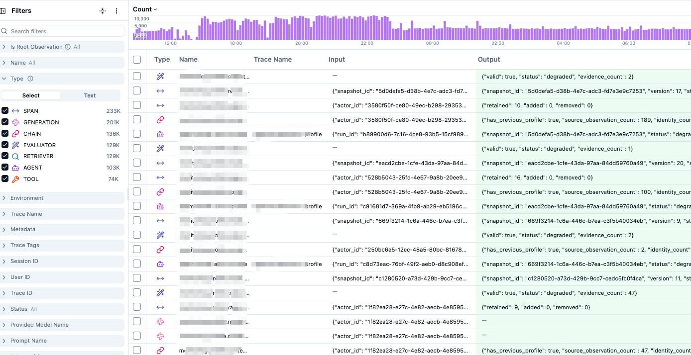
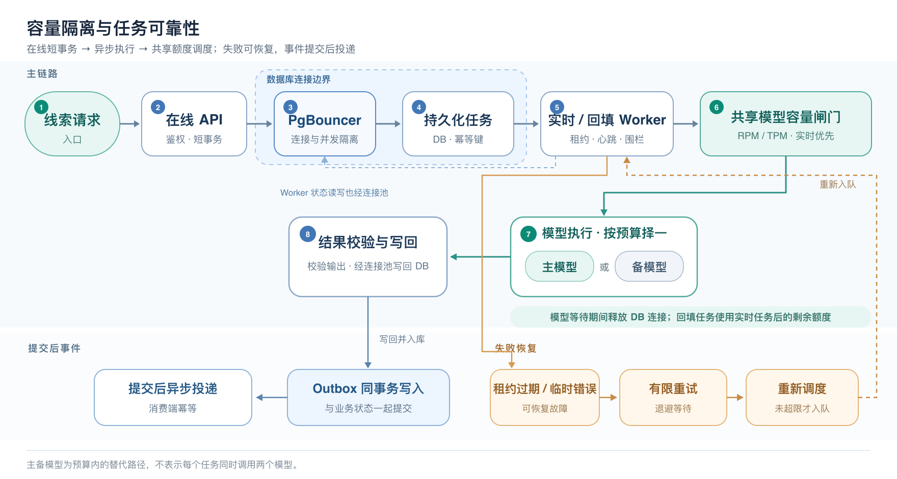

# AI Agent 工程化（一）：模型没崩，系统先崩了

从单客户 Demo 扩展到 50 多个客户、日入库 15 万～20 万条线索后，我们遇到的第一道坎不是单条线索判得准不准，而是能否及时判完。

项目初期，我主要在调整风险场景、提示词、上下文和工具调用，目标很明确：**让 Agent 判断一条线索是否存在风险、是否值得运营继续跟进。**低流量时，Agent 可以先给出判断和依据，运营人员再复核高价值候选，这条链路跑得通。

规模上来后，数据库连接池频繁耗尽，任务持续积压，模型网关也开始限流。部分客户的新线索要等上几个小时，历史回填还与实时研判争抢资源。单次研判仍能完成，但系统已无法按线索进入的速度稳定交付结果。

# 前言

这里简单介绍下项目背景：旧平台主要依赖关键词规则。规则能够找到“可能存在风险”的内容，却无法准确判断上下文。只要命中某个产品词或风险词，线索就会进入人工审核队列。**结果是一线运营人员大约 80% 的时间都花在了审核线索上，只有约 20% 的时间用于继续跟进和生成事件。**项目初衷是为了减少运营人员的重复审核工作。

新流程保留规则初筛，把语义研判放在人工复核之前：`原始线索 → 产品词、排除词和场景规则初筛 → Agent 研判 → 高价值候选 → 人工复核 → 风险事件`

规则负责缩小候选范围，Agent 结合线索正文、场景配置和历史案例给出判断与依据，最终是否形成事件仍由运营人员确认。POC 阶段，我们主要验证研判质量和输出稳定性，几百到几千条线索都能顺利跑完。但这没有回答另一个问题：**当数据持续进入时，规则会产生多少任务，这些任务又会占用多少数据库连接和模型额度？**

# 问题链路排查

最早暴露问题的是运营端：新线索进入后迟迟没有研判结果，审核页面偶尔卡顿，部分操作返回服务错误。排查任务队列时，我们发现任务持续积压；失败任务的重试又增加了实际处理量。即使服务仍在运行，只要入队速度长期高于完成速度，等待时间就会不断拉长。


面对积压，我们最初提高了 Worker 并发。短时间内领取的任务变多了，数据库连接和模型请求也随之增加；超时与限流触发更多重试，反过来加重积压。问题不只是“处理得慢”，而是**扩并发后负载被进一步放大**。

## 为什么按 20 万条线索规划容量会失准？

最初，我们按每天进入系统的原始线索量规划 Worker 和模型额度。但生产负载并不会停留在入口：同一条 Raw 可能命中多个风险场景，派生多条候选线索和研判任务；一个 Job 在执行时，还可能因输出修复、超时或失败重试，多次请求主研判模型。**原始线索数、场景命中数、Job 数和模型请求数，是四个不同的容量口径。**

一次任务盘点记录了 59\.68 万次场景命中和 106\.37 万个研判任务。若两者属于同一统计周期，Job 数约为命中数的 1\.78 倍；但这不是“任务数相对原始线索数”的放大倍数。要解释多出的任务，还需要按任务类型和创建路径拆开核对，不能仅用“每命中一个场景就创建一个 Job”概括。

任务量还不是模型请求量。RAG 检索、OCR 和翻译会消耗各自的资源；主研判模型的压力则应单独计算，包括首次请求以及输出修复、失败重试带来的额外请求：`主研判模型请求量 ≈ 研判 Job 数 × 每个 Job 的平均主模型请求次数（含重试）`

我们当时只盯着入口的线索量，没有持续观察“Raw → 场景命中 → Job → 模型请求”这条漏斗，因而低估了 Worker 和模型所需的容量。**问题不在于模型突然变慢，而在于我们没有看清负载如何被逐级放大。**



## 增加 Worker 为什么让系统崩得更快

任务开始积压时，我们最先想到的是增加 Worker。短时间内，更多任务确实被领取了；但领取任务只是起点。每个任务还要读取线索与场景配置、更新数据库状态，并请求模型网关。**增加 Worker，实际上也提高了对数据库和模型额度的并发需求。**

当时我们没有把 API、各类 Worker、Scheduler 的连接池放在一起做预算。应用侧潜在的连接需求可以粗略估算为：`潜在连接需求 ≈ Σ［各类进程副本数 ×（连接池大小 + Overflow）］`

这表示可能达到的上限，不是实时连接数；Worker 并发数也不等于连接数。但新增 3 个 Worker 副本后，再叠加 API、回填、同步和维护进程，峰值访问很容易集中出现。任务可能在应用连接池或 PgBouncer 等待连接，数据库读写随之变慢。


与此同时，更多任务向共享的模型网关发起请求，RPM 限额被打满，部分请求超时或收到 429。如果失败任务很快重试，重试流量又会占用 Worker 槽位和模型额度。结果是领取速度提高了，**有效完成速度却没有同步提高**：

```Plain Text
增加 Worker
→ 同时提高数据库访问和模型请求并发
→ 连接等待、模型限流与超时增加
→ 单任务完成时间变长，重试增多
→ 有效吞吐下降，队列继续积压
```

我们当时仍用 Docker Compose 编排，但这不是问题的根因。即使换成 K8s，数据库连接和模型 RPM 也不会凭空增加。**这次教训不是不能扩 Worker，而是扩容前必须同时算清数据库、模型和任务的容量预算；否则只是把瓶颈更快地推向下一环。**这正是 Agent 系统里的木桶效应。


## 真正的问题：没有全链路容量模型

复盘后我们发现，缺的不是某一个组件，而是一套能把**原始线索、研判 Job 和模型请求**换算到同一口径的容量账。仅看每天入库多少条线索，无法判断 Worker 和模型究竟要处理多少工作：

```Plain Text
新增 Job/日 ≈ 原始线索/日 × 入队比例 × 每条入队线索平均生成的 Job 数

可持续完成 Job/日 ≈ min（数据库、调度、Worker、模型、结果写入
                         各环节折算后的 Job 处理能力）

每日积压增量 ≈ 新增 Job 数 − 完成 Job 数
```

以模型侧测试结果为例，在当时的任务结构下，主备模型理想情况下每小时可处理约 5,000～7,000 条线索。即使连续运行 24 小时，也只是约 **12 万～16\.8 万条/日**；生产环境还必须为响应时间波动、失败重试、流量高峰和历史回填留出余量。将 70%～80% 作为初始规划水位可以帮助估算，但最终仍要由压测结果和交付时效要求来校准。


真正需要比较的，是**每天进入研判队列的工作量**与**每天稳定完成的工作量**。如果前者长期高于后者，即使所有服务都没有宕机，队列也会持续增长。此时单独增加 Worker 无法消除缺口；应先减少无效入队、重复 Job 和额外模型请求，隔离实时任务与历史回填，再根据剩余缺口扩充数据库或模型容量。

# 开源节流：先控制流量，再提高容量

## 建立线索漏斗

扩容前，我们先把线索从进入系统到形成事件的过程按统一口径拆开统计：`原始线索 → 规则初筛 → 场景命中 → 候选线索 → Agent Job → 执行尝试 → 模型请求 → 风险判定 → 人工确认 → 风险事件`。

它不是一个只会逐层缩小的漏斗。排除规则会减少候选，一条 Raw 命中多个场景又会放大任务量；输出修复和失败重试则可能继续放大请求量。因此，每一层都要同时记录**去重后的线索数**和**实际发生次数**，并按客户、场景和关键词观察过滤率、放大倍数、排队时间与处理耗时。

有了这本“流量账”，我们才能判断压力来自宽泛关键词、重叠场景，还是重复调用，并决定先治理规则、合并任务、优化重试，还是扩充模型容量。我们也会关注每千次模型请求最终带来多少经确认的风险事件，但必须同步抽检被过滤或判为无风险的线索：**节省调用不能以漏掉真实风险为代价。**

## 减少无效任务与重复调用

历史批量导入的产品词、风险词缺少持续治理：部分词过于宽泛，单独命中就能形成候选；一些场景边界重叠、排除规则不足，使大量低价值内容进入研判。业务配置的宽松，最终变成了任务队列和模型资源的压力。

旧流程中，同一条原始线索命中多个场景时，会分别创建 Candidate 和 AgentJob。改造后仍保留各场景的 Candidate 及独立判断结果，但将**同一条线索的多场景研判合并为一个 Job**。常规路径由一次主研判模型请求返回各场景结果；输出异常或执行失败时，仍可能回退、重试并产生额外调用。

```Plain Text
改造前：按场景分别创建任务

1 条原始线索
├─ 命中场景 A → Candidate A → AgentJob A → 模型研判 A
├─ 命中场景 B → Candidate B → AgentJob B → 模型研判 B
└─ 命中场景 C → Candidate C → AgentJob C → 模型研判 C

若 3 个 Job 均执行：3 个场景候选 → 3 个 Job → 至少 3 次主研判
```

减负分两步推进。**首先清理经抽样验证的宽泛词和低价值规则，补充确定性排除条件，减少不必要的候选。其次治理重复执行：内容 Hash、链接、主体和时间窗口可用于发现相似线索，但相似内容不能直接视为同一风险。前置聚合与历史结果复用，须先经过影子测试和漏报回归。**

```Plain Text
改造后：按原始线索合并研判任务

1 条原始线索
└─ 场景匹配
   ├─ Candidate A（场景 A）
   ├─ Candidate B（场景 B）
   └─ Candidate C（场景 C）
      └─ 共同关联到 1 个 AgentJob
         └─ 常规路径：1 次主研判模型请求
            ├─ 场景 A 结果 → 写回 Candidate A
            ├─ 场景 B 结果 → 写回 Candidate B
            └─ 场景 C 结果 → 写回 Candidate C

异常路径：输出不完整或格式错误时，可能回退、重试并追加调用
```

效果分别看两个指标：**每条进入研判的去重原始线索创建多少个有效 Job**，以及**每个已执行 Job 发起多少次主研判模型请求**。常规路径的目标均接近 1，同时监控回退率、重试率和漏报率，而不是只追求更低的调用数。


## 容量隔离与任务可靠性

在线 API 保持短事务，只负责鉴权、业务状态写入和持久化任务创建；数据同步、风险研判和历史回填由独立 Worker 执行。但异步化不等于容量隔离：增加 Worker 仍会推高数据库连接数和模型请求量。为此，我们引入 PgBouncer，限制各类 Worker 的连接池与并发，并在等待模型响应时释放数据库连接。模型侧还需建立跨 Worker 的全局预算，分别控制主、备模型的并发与 RPM/TPM，让实时任务优先、回填任务使用剩余容量。



任务可靠性是另一层问题。幂等键避免同一处理版本重复创建有效任务；租约和心跳让中断任务能够重新领取，围栏令牌则阻止失去租约的旧 Worker 写回结果。临时网络故障和限流采用有限重试与退避；需要对外投递的通知与业务数据在同一事务中写入 Outbox，事务提交后再异步投递，并由消费端做幂等处理。无法自动修复的输出或业务校验错误，则保留失败记录供排查，而不是无限重试。

## 客户公平调度与可观测性

客户增加到 50 多个后，我们发现只看总吞吐量还不够。当前主研判任务主要从全局队列领取，虽然已经区分实时与回填任务，并考虑候选优先级，但处理机会尚未按客户公平分配。当大客户持续产生大量任务时，其他客户的新线索仍可能等待很久。下图用全局 FIFO 的极端情况，简化说明这种失衡：


下一步的目标是在有限的 Worker 和模型容量之前，增加客户级调度：按客户轮询或分配权重，限制单客户并发，为实时、高价值任务保留处理机会，让历史回填使用剩余容量。这样做未必提高模型的总吞吐量，但能避免少数客户长期占满资源。


要判断改造是否有效，不能只看队列是否变短，还要看各客户的等待时间是否收敛。Sentry、Langfuse 和业务数据库分别帮助我们定位服务异常、追踪 Agent 执行过程、核对任务终态；将这些记录关联起来，重点观察各客户的排队时长、最老任务年龄、容量占用，以及模型限流和重试情况，才能区分“总容量不足”和“容量分配不公平”。


## 改造前后的数据对比

我们用改造前后两个等长的生产统计窗口对比。期间同时发生了客户与场景规则调整、线索入口变化和 Job 合并，因此以下数据反映的是**这一轮治理的整体效果**，不能把所有下降都归因于某一项改造。

|指标|改造前|改造后|变化|
|---|---|---|---|
|新入库线索|849,802|501,446|下降 41\.0%|
|场景命中次数|173,879|44,411|下降 74\.5%|
|每万条入库线索的场景命中次数|2,046|886|下降 56\.7%|
|新建风险研判 Job|172,659|31,003|下降 82\.0%|
|每万条入库线索新建的 Job|2,032|618|下降 69\.6%|
|新建 Job／场景命中次数|99\.3%|69\.8%|下降 29\.5 个百分点|
|窗口内完成的风险研判 Job|8,593|45,469|约为此前 5\.29 倍，含历史积压|
|已完成 Job 的“创建→完成”P95|49\.82 小时|5\.13 小时|明显缩短|

新入库线索下降解释了部分总量变化，但不是全部。按相同入库规模折算，每万条线索产生的场景命中从 2,046 次降至 886 次，新建 Job 从 2,032 个降至 618 个。这说明除入口流量变化外，规则治理和任务创建环节也减少了单位线索带来的负载。

同时，窗口内完成的 Job 增多，已完成任务的 P95 时延下降。不过，完成量包含对历史积压的消化；P95 也只覆盖已完成任务，不能单独证明队列已经恢复健康。还需结合**窗口末待处理 Job 数和最老待处理任务年龄**，判断积压是否真正持续下降。

最关键的是，再补一项直接验证 Job 合并的指标：**同一统计窗口内，进入研判的去重线索数，以及每条线索平均创建的有效 Job 数**。目前的“Job／场景命中次数”只能提示任务放大有所缓解，不能精确拆出 Raw 级合并的独立收益。

# 从Demo到生产落地的思考

回头看，这次事故打破了我们一个朴素的判断：**Agent 能跑通，不等于系统能稳定交付。**模型能力越强，我们越敢把复杂任务交给它；但工具越多、执行链越长，数据库、队列、并发控制、失败恢复等环节的短板，也越容易在规模增长时暴露。

Demo 阶段，我们验证 Agent 能不能完成一次任务；进入生产后，还必须回答：每天面对二十万条线索，它能否持续处理？高峰时能否扛住？失败后能否恢复？结果能否追溯？**模型拓展了系统能做什么，传统后端工程决定这些能力能否长期、可靠地交付。**
